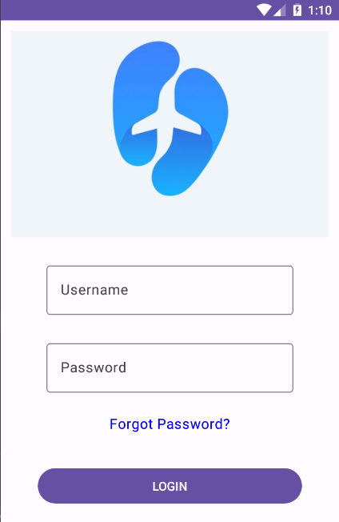
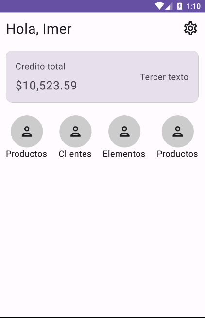
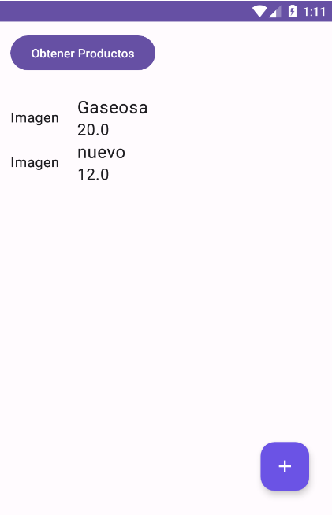
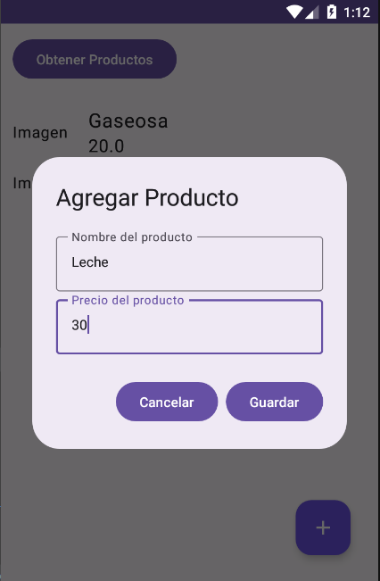
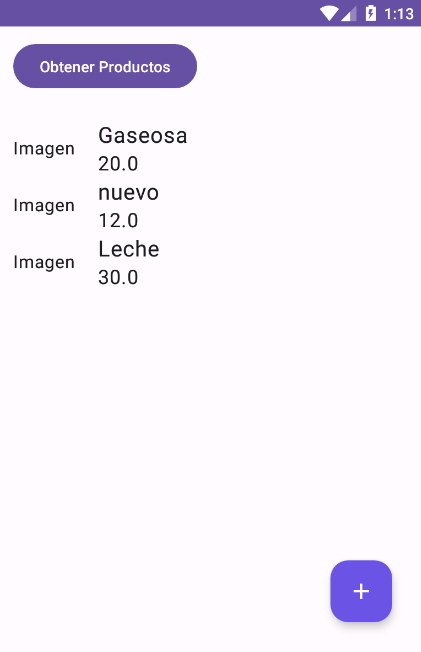

# CREDITO APP - JETPACK COMPOSE

Stack usando en la Aplicacion
- Jetpack Compose
- Room
- Sqlite
- Python - Backend
- MongoDB - SGBD

## Pantallas de la APP

GET STARTED

LOGIN SCREEN

PROFILE SCREEN

PRODUCTOS SCREEN

ADD PRODUCTO SCREEN

UPDATE SCREEN

